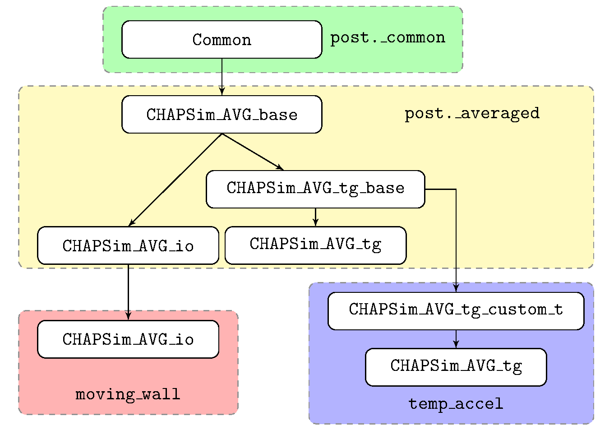
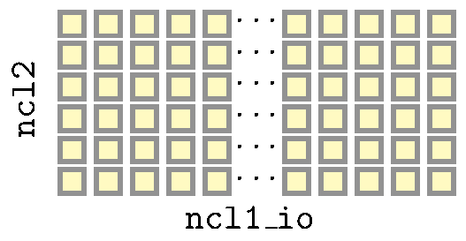
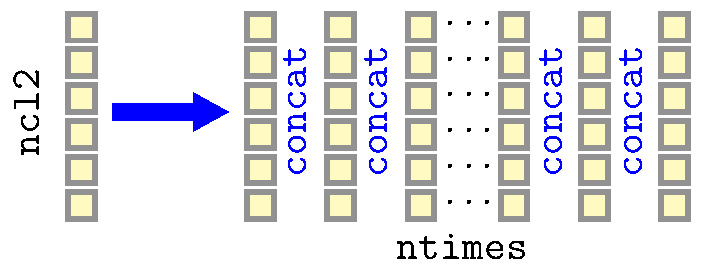

.. _develop_guide:

=================
Developer's Guide
=================

This section is designed to facilitate the development of extensions to CHAPSim_post. It will cover the understanding of CHAPSim_post's ``post`` module code structure which where most of the extraction and visualisation code is defined

Understanding CHAPSim_post's code structure
-------------------------------------------

The ``post`` module contains several sub-modules which are used to construct it. Each sub-module is dedicated to a different set of classes generally grouped by the data being processed. These modules are summarised below:

* **_averaged** - Contains the CHAPSim_AVG classes for processing non-periodic and periodic data.
* **_instant** - Contains the CHAPSim_Inst classes
* **_fluct** - Contains the classes for postprocessing the fluctuating flow quantities
* **_budget** - Contains classes for processing budgets including Reynolds stress, turbulence kinetic energy, and momentum budgets
* **_meta** - Contains classes for storing metadata including coordinate arrays and metastruct's for data from the readata.ini file
* **_common** - Contains base classes used for all classes which visulise data
* **_autocov** - Calculates the spatial autocovariance as well as autocorrelation function and spectra 
* **_quadrant_a** - Performs quadrant analysis using the hyperbolic hole method of Willmarth and Lu
* **_joint_pdf** - Computes joint probability density functions of :math:`u'` and :math:`v'`. 

With the exception of ``_meta`` and ``_common``, all sub-modules have the same basic structure containing a *base* class which inherits from the abstract base class ``ABC`` and ``Common``. ``Common`` will be described in more detail later. The base class is built on the notion that much of the code can be made in common between spatially and temporal developing visualisations. Then separate classes are created for the non-periodic and periodic flows.  The non-periodic classes typically have suffixes ``io`` and the periodic classes have suffix ``tg`` e.g. ``CHAPSim_AVG_io`` and ``CHAPSim_AVG_tg``. Most classes have a reasonably straight-forward code_structure with a base class and a single *io* class and *tg* class. The exception here are the CHAPSim_AVG classes which will now be discussed in more detail. This example will also show how CHAPSim_AVG classes have been derived from those found in the post module to account for specific physics.

The CHAPSim_AVG classes
^^^^^^^^^^^^^^^^^^^^^^^

A diagram showing the inheritance structure of the different CHAPSim_AVG classes.

   Inheritance structure of the CHAPSim_AVG classes

This diagram shows the CHAPSim_AVG_base class which inherits from Common and results in two derived classes ``CHAPSim_AVG_io``, which has been used in the :ref:`user_guide` as well as ``CHAPSim_AVG_tg_base`` which acts as a base class for the ``CHAPSim_AVG_tg``. The primary difference between these two classes is that CHAPSim_AVG_tg_base can extract any times specified from the periodic results whereas CHAPSim_AVG_tg will process all results after the value of the ``time0`` keyword argument. 

The reason for this distinction is that the periodic domains are averaged in both the streamwise and spanwise directly and are hence one-dimensional whereas the non-periodic domains are two-dimensional having been averaged in just the spanwise direction. The main developer of the code's primary need to processing periodic domain data comes from performing temporal acceleration simulations. To increase code commonality, the CHAPSim_AVG_tg classes are designed so that these one dimensional arrays are stacked so that from the perspective of the data handling they are the same except for a number of small modifications. Diagrams showing this idea can be seen below

   Diagram showing the data layout in the two-dimensional ``io`` classes

Some of the main differences between the the tg code and io code relate to the default axis labels. For the io code this would be :math:`x/\delta` whereas for the ``tg`` code it is :math:`t^*`. The :math:`x` axis values are in the tg case the list of times present rather than the :math:`x` coordinates of the case. Other changes relate to the calculating of the budget terms which involve vector calculus operations such as :math:`\nabla^2` which in the ``io`` case includes a :math:`\partial^2/\partial x^2` which is not the case ``tg`` code which is homogeneous in the streamwise direction. This list of differences is not exhaustive but gives a flavour of the differences between the different aspects.

   Diagram showing the arranging of the periodic data into two dimensions

It is considered that some users will want to process assymptotic averages of the periodic components. This can still be done using the ``CHAPSim_AVG_tg_base`` class although it is not well optimised for this due to the lack of streamwise or temporal development. These improvements are on the 'to-do' list. 

Creating your own modules
-------------------------

A useful resource for creating your own CHAPSim_post modules is to view the ``moving_wall`` or ``temp_accel`` modules which are extensions of ``CHAPSim_post.post`` for specific flows. Many features of the code structure are developed to maximuse the ability of the code to be extended. before some of the important aspects of this are discussed a case study will be presented.

The ``moving_wall`` Module
^^^^^^^^^^^^^^^^^^^^^^^^^^

This module is designed to post-process results from an entension of CHAPSim where the wall velocity, beginning at rest, would become increasing negative setting up a relative acceleration between the flow and wall. This resulted in a number of alterations being required compared the classes in ``CHAPSim_post.post``. 

* Calculation of bulk velocity needed to account for the moving wall if desired.
* The wall shear stress calculation needed to account for the fact that the wall velocity was no longer 0.
* A requirement that quantities such as the integral thicknesses could be computed relative to the wall
* Some plots altered to allow plotting relative to the wall

  * :math:`u^+` vs :math:`y^+`
  * Mean flow profiles.

* A location was required to store the moving wall velocities which had been output to file by CHAPSim.

While these changes appear limited, there are some potential serious consequences. As mentioned in :ref:`user_guide`, the CHAPSim_AVG classes are used by other classes in the calculation of normalisations. A perhaps less obvious example of this is plotting the :math:`x-z` plane contour plots where the :math:`y` axis value is typically specified in wall units which requires knowledge of the wall shear stress. This means that to calculate these parameters other classes must 'know' which version of CHAPSim_AVG to instantiate. Given that the CHAPSim_AVG class is often instantiated in a class' ``__init__`` method one method would be to define a class in the extension module which inherits from the desired class albeit with an overriden ``__init__`` method. This however was deemed in many cases to be excessive when this typically only required modification to a single line of code. 

This is not a problem exclusive to the CHAPSim_AVG class but also to the CHAPSim_fluct classes which are used in the calculation of the autocovariance. The solution to this problem was to use class aliasing.

Class Aliasing
^^^^^^^^^^^^^^

All the main classes derive from the class ``Common``. This contains a number of useful methods most significantly the ``classproperty`` (A custom implementation the property decorator that can also work on the class rather than just an instance of it) method ``_module``. This enables a class or object to be able to dynamically work out what module it was declared in. 

In classes such as ``CHAPSim_fluct_io`` in the ``post`` module, instead of calling CHAPSim_AVG_io as done in the :ref:`user_guide` examples it calls ``self._module._avg_io_class``. If you look in the ``moving_wall module`` you will note that there is a derived class of ``CHAPSim_fluct_io`` although nothing has been overriden. You will also note that CHAPSim_AVG_io has been overriden to meet the needs specified above and that ``_avg_io_class = CHAPSim_AVG_io``.

Due to the redeclaration of CHAPSim_fluct_io, ``self._module`` will be equal to the ``moving_wall`` module and hence the low-level code in ``post`` will actually call the CHAPSim_AVG_io declared in the ``moving_wall`` module rather than in ``post``. 

Hence this solves the issue mentioned in the previous section and allows the code to be easily extended with extensive redeclaration of previously written code. In theory, the ``_avg_io_class`` variable doesn't necessary have to point to a class declared in its own module however in practice it is a good idea as it ensures to correct versions of classes are called. It also simplifies post-processing scripts as all the classes required for a particularly post-processing is in the same module. 

Writing code to be run on HPCs
------------------------------

In general, Python particularly with its array of libraries and extensions particularly Numpy which is itself written in C is sufficient to process most data. Numpy often uses libraries that can use multithreading and this can be significant speed up when run in parallel. Furthermore running of HPCs reduces file access times which id one of if not the most costly aspect of CHAPSim_post.

However, there are a limited number of exceptions where native python is too slow, particularly code that requires heavy use of loops. This is particularly the case when creating statistics that are not typically processed by CHAPSim or require significant time and memory use to be computed by it. The case in the existing code are the autocorrelations. 

The good news is that there are a range of tools which can be used. I will point the reader to three: Numba, f2py, and Cython.

Numba
^^^^^

Numba is a python module that accelerates python by translating it into fast code using just-in-time compilation. It is also capable of providing multithreading other substantial speed ups versus native python. It is also easy to use simply requiring a decorator.

.. code-block:: python

   import numba

   @numba.njit(parallel=True)
   def func_to_be_acceleration(*args,**kwargs):
       
This performs multithreading and uses JIT, there are some limits to this. For more information visit its `documentation <https://numba.readthedocs.io/en/stable/index.html>`_

``f2py``
^^^^^^^^

This is a Numpy module that allows fortran code to be called from Python. It is also possible to use OpenMP with the Fortran as well as compiler flags to optimise the code so that there can be signficant speed ups. To use this additions need to be made to CHAPSim_post's setup.py file. Documentation can be found `here <https://numpy.org/doc/stable/f2py/>`_. Documentation for the setup.py file can be found with Numpy's `disutils <https://numpy.org/doc/stable/reference/distutils.html>`_ module.

Cython
^^^^^^

Cython is a pythonic language that allows calling of C routines. Cython passes the code to create efficient C code which is then compiled and can be called from Python. This is also has modules for multithreding via OpenMP and very fast code can be generated. The default method of calculating the autocorrelations in done in cython. Example code can be found in the library src directory. Documentation can be found at `<https://cython.org/>`_.

``f2py`` and ``Cython`` require compilation on an HPC this requires libraries to be available at compilation and runtime. This will likely need to be done using ``module load`` commands.
